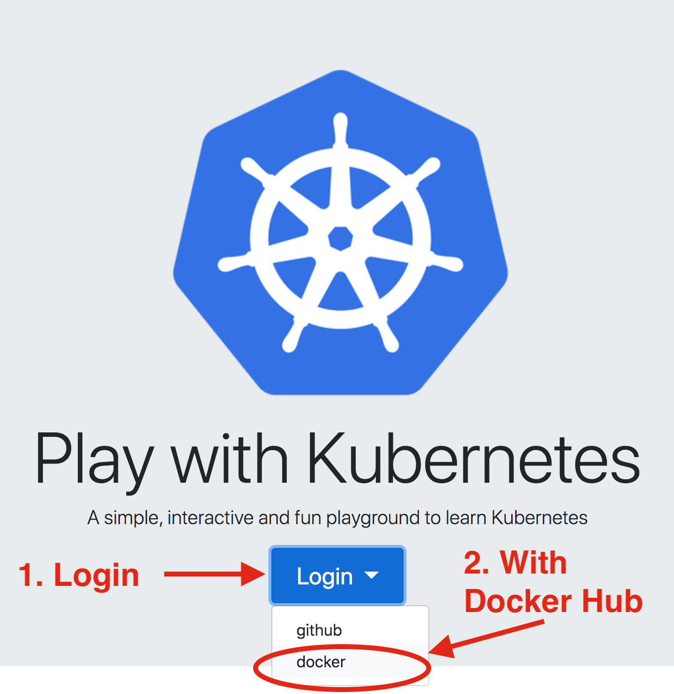
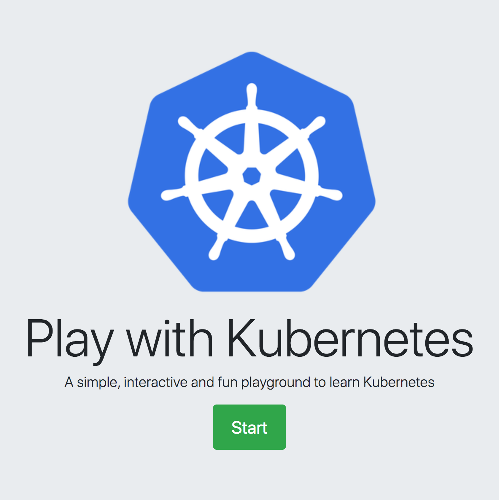
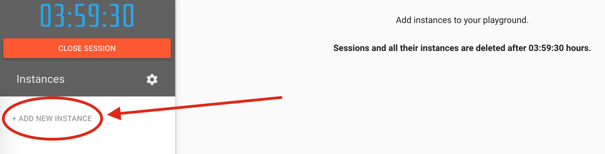
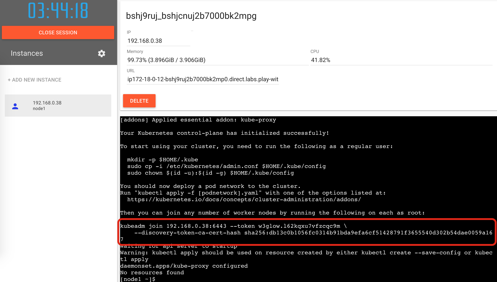

Creating your Kubernetes cluster
================================

Launch and configure a 2-node Kubernetes cluster on `labs.play-with-k8s.com <https://labs.play-with-k8s.com>`_.

Launching your k8 instance
--------------------------

Head over to https://labs.play-with-k8s.com and log in with your Docker Hub account.

You should now have the option to "start" your remote Kubernetes (k8) instance.

You'll notice a timer in the upper-left, counting down the time left on your instance.
This is a great free resource, but all changes will be lost between shutdowns.
The pane on the left will list any VMs you launch in your instance, and the right pane will expose a terminal of the selected VM.

Creating your orchestrator
--------------------------

Now, create your first VM, which will serve as the orchestrator of your Kubernetes cluster, by clicking ``ADD NEW INSTANCE``.

Once this is running, you'll be presented with a terminal. Run the first two suggested commands to provision your orchestrator and allow other VMs to join your cluster:

1. Initialize the orchestrator (this) node
++++++++++++++++++++++++++++++++++++++++++

::

   kubeadm init --apiserver-advertise-address $(hostname -i) --pod-network-cidr 10.5.0.0/16

You may see some warnings after this command, no errors.
This command also generates a command for registering other nodes to this Kubernetes cluster, which you should save.

Each join command contains a unique key, so you should save yours and not rely on mine.

2. Initialize networking
++++++++++++++++++++++++

::

   kubectl apply -f https://raw.githubusercontent.com/cloudnativelabs/kube-router/master/daemonset/kubeadm-kuberouter.yaml

Creating your worker
--------------------

Create a second VM to serve as the worker in your Kubernetes cluster by clicking ``ADD NEW INSTANCE`` again.
Once that VM done initializing and you are presented with a terminal, run your unique ``kubadm join`` command.

This should complete fairly quickly, and you can confirm it worked by switching back to your orchestrator (node1) and running

::

   kubectl get nodes

if everything was set up correctly, you should see output similar to the following.

::

   NAME    STATUS   ROLES    AGE   VERSION
   node1   Ready    master   19m   v1.18.4
   node2   Ready    <none>   21s   v1.18.4

At this point, your 2-node Kubernetes cluster with one orchestrator and one worker is set up and ready to accept tasks.
If you wanted to add another worker to your cluster, just repeat the steps in this sub-section.
Kubernetes can scale up to 5,000 workers, and each worker can be a VM or a physical machine that "joins" the cluster.
