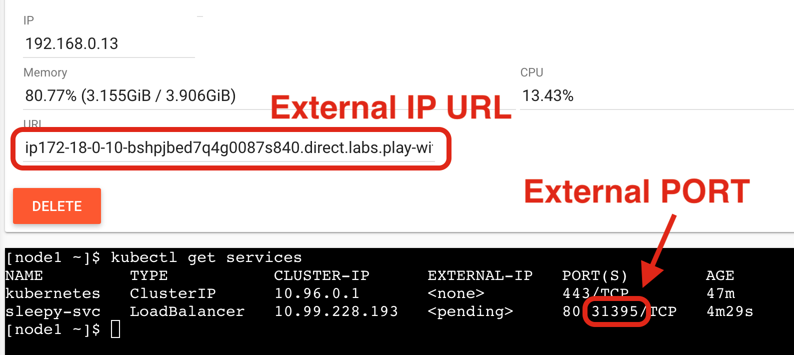

Exposing services
=================

The ``kubectl expose`` command creates a *service* for existing pods.
A *service* is a stable address for a pod or deployment.

A *service* is always required to make an external connection, and once created, ``kube-dns`` will allow us to resolve it by name (i.e. after creating service `hello`, the name `hello` will resolve to something).

Basic service types
-------------------

ClusterIP (default type)
   A virtual IP address is allocated for the service (in an internal, private range), which is reachable only from within the cluster (nodes and pods). Code can connect to the service using the original port number.
NodePort
   A port is allocated for the service (by default, in the 30000-32768 range) that port is made available on all our nodes and anybody can connect to it. Code must be configured to connect to that new port number
LoadBalancer
   An external load balancer is allocated for the service, and sends traffic to a ``NodePort``.
ExternalName
   The DNS entry managed by ``kube-dns`` will just be a `CNAME` to a provided record. No port, no IP address, no nothing else is allocated.

Exposing a port
---------------

The docker container `gzynda/sleepy-server <https://hub.docker.com/r/gzynda/sleepy-server>`_ serves a webpage on a specified port after sleeping a specified number of seconds.
The configuration file `sleepy.yaml <https://github.com/zyndagj/kubernetes_basics/blob/master/config/sleepy.yaml>`_ creates a deployment and exposes it outside the cluster on port 80.
It then creates the ``sleepy-svc`` *service* to expose port 80 of the deployment to the outside world.

.. literalinclude:: ../configs/sleepy.yaml
   :language: yaml
   :linenos:

Get the external port of your deployment by listing your available services and looking for the (second) port after 80.

Paste both the URL and PORT into your web browser in the URL:PORT format to view the running webpage from this deployment.

You'll notice that the webpage displays the name of the host it is being served from, sleeps for half a second, and then finishes printing "Hello World!".
If the page takes around half a second to complete loading every time it is requested, how many pages can be served per second?

We can confirm this by stress-testing the web server with `seige <https://www.joedog.org/siege-manual/>`_ using 1 worker (``-c1``), 0 delay (``-d0``), and 10 tries (``-r10``).
I recommend running the docker container directly for this use case.

::

   $ docker run --rm -t yokogawa/siege -d0 -r10 -c1 [node2 IP]:[external PORT]

   ** SIEGE 3.0.5
   ** Preparing 1 concurrent users for battle.
   The server is now under siege..      done.

   Transactions:                     10 hits
   Availability:                 100.00 %
   Elapsed time:                   5.02 secs
   Data transferred:               0.00 MB
   Response time:                  0.50 secs
   Transaction rate:               1.99 trans/sec
   Throughput:                     0.00 MB/sec
   Concurrency:                    1.00
   Successful transactions:          10
   Failed transactions:               0
   Longest transaction:            0.51
   Shortest transaction:           0.50

Which should confirm that the deployment can serve ~2 responses per second, since it sleeps for half a second when rendering the page.

Scaling the web server
----------------------

Assuming we want more people to enjoy our sleepy server, you can serve more concurrent requests by scaling up the deployment.

::

   kubectl scale --replicas=2 deployment.apps/sleepy

The ``LoadBalancer`` will automatically balance the traffic between pods.
If you **refresh** the webpage, you should notice that the host name periodically changes.

You should also see an increased transaction rate if you re-run siege.
Just be sure to increase the number of concurrent users to at least 3.

::

   $ docker run --rm -t yokogawa/siege -d0 -r10 -c3 [node2 IP]:[external PORT]

   ** SIEGE 3.0.5
   ** Preparing 3 concurrent users for battle.
   The server is now under siege..      done.

   Transactions:                     30 hits
   Availability:                 100.00 %
   Elapsed time:                   9.04 secs
   Data transferred:               0.00 MB
   Response time:                  0.87 secs
   Transaction rate:               3.32 trans/sec
   Throughput:                     0.00 MB/sec
   Concurrency:                    2.89
   Successful transactions:          30
   Failed transactions:               0
   Longest transaction:            1.51
   Shortest transaction:           0.50

Try scaling up the server to more replicas and benchmarking your transaction rate again.
